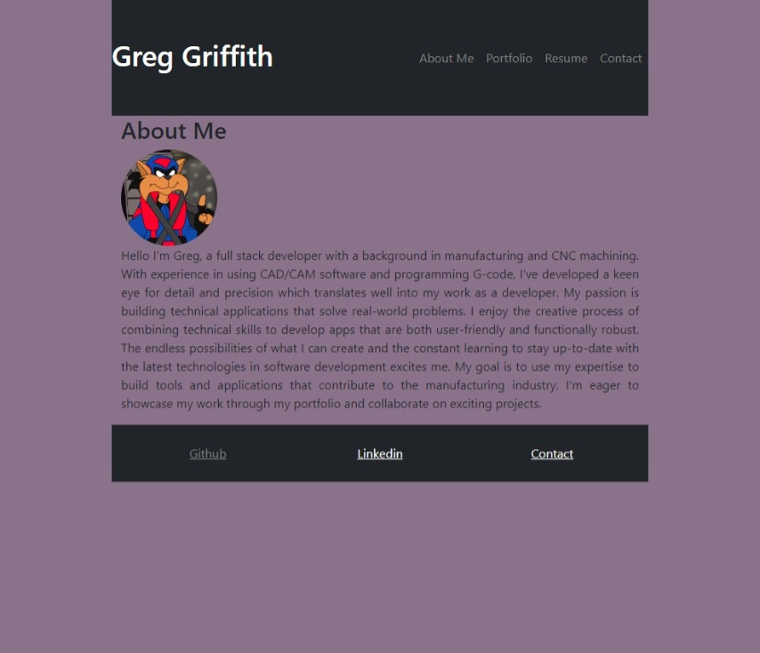
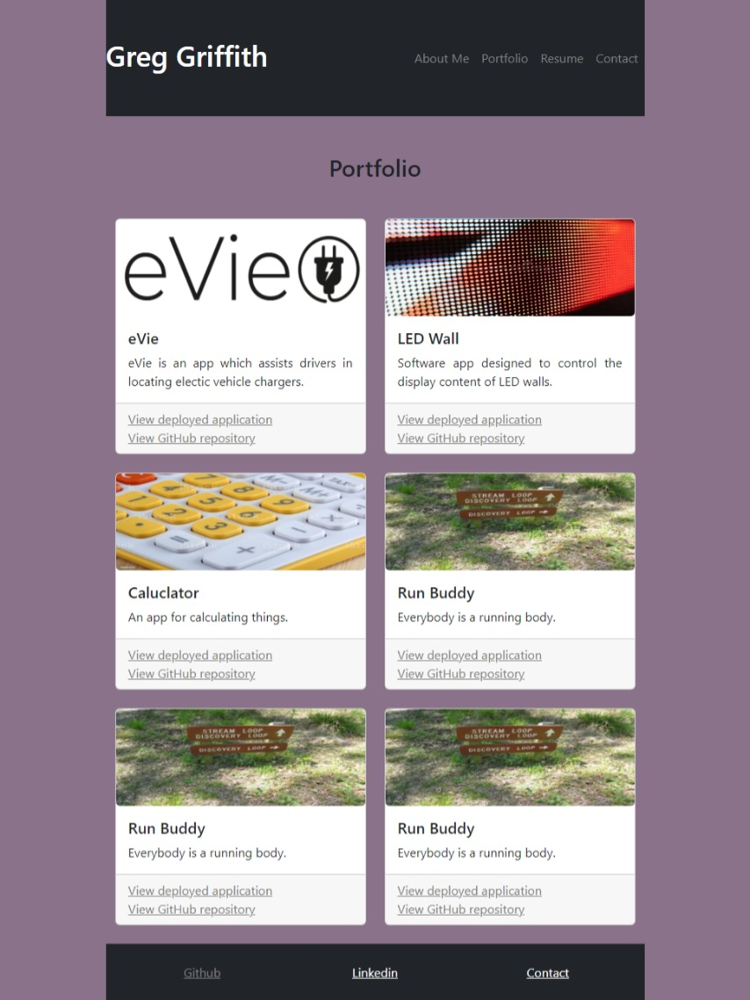
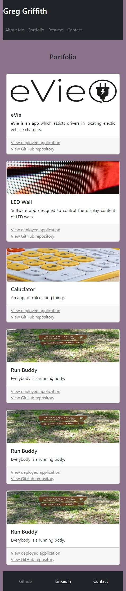
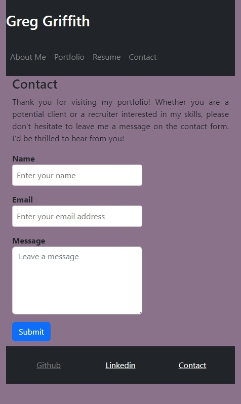

# REACT PORTFOLIO	

## Description

This is a simple React app that displays my portfolio website. The app has several pages, including an About Me page, a Portfolio page, a Resume page, and a Contact page. Users can navigate between the pages by clicking on the navigation links at the top of the page.

## Table of Contents

- [Usage](#usage)
- [License](#license)
- [Questions](#questions)
- [Notes](#notes)
- [Screenshots](#screenshots)

## Usage

The app has been deployed to GitHub Pages. To view the deployed app, simply navigate to https://gregarijah.github.io/challenge-20-react-portfolio/ in your web browser.

## License

This project is licensed under the terms of the [MIT License](https://choosealicense.com/licenses/mit/).

## Questions

GitHub: [gregArijah](https://github.com/gregArijah)

## Notes

This project was bootstrapped with [Create React App](https://github.com/facebook/create-react-app).

## Screenshots

